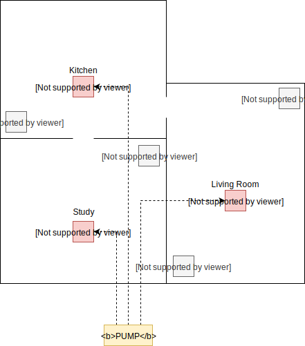

## HVAC whitepaper

### __Introduction__
This whitepaper addresses the key principles used to develop the HVAC function blocks in this home automation project. The main approach remains the same as for any other functionality in the project:

- seemingless integration with any third party home automation software through the MQTT protocol.
- core logic build inside PLC in case failures occur in less robust hardware. 
- hardware continuity to prevent problems in your HVAC setup in the future.

Additionaly the suggested HVAC implementation uses zoning system approach allowing users to control the temperature for each area, or “zone” in your home, rather than have to heat or cool the whole house to the same temperature. With a zoning system, you can set temperatures differently for either individual rooms or sections of your home.

### __Reference floorplan__
Observe the floorplan below as an example for this reference case:

There are three rooms, each having their own functional usage and thus possibly requiring different HVAC behaviours depending on multiple factors. For example:

- the study might be used rarely and thus does not require heating all the time or to a same level as the kitchen.
- the living room might only be used in the evening and thus require only heating then in the contrary to the kitchen that is used for breakfast as well in the morning.

Depending on the heating infrastructure it makes sense to have as much as correlated control as possible. For example:

- a boiler in combination with radiators will heat up a room relatively fast and thus can zoning can be usefull to only heat sections/rooms of your home on timestamps the rooms are possible
- a heatpump system or gas driven boiler in combination with floor heating is slow heating system thus zoning might not be usefull or triggered by the software when implemented in frequent usage rooms. This is however hard to predict without in depth knowledge of your house. Eitherway zoning with floor heating systems allows for correlated control of temperature which can be a desired luxary for for example sleeping rooms.

The implementation developed in this project allows for both scenarios to be used.

### __Sensors and actuators__
In order to allow granular zoning control of multiple sections/rooms in any home each section/room should have one or multiple sensors and actuators available. An updated reference floorplan illustrates this:

Each section/room now has the following:

- One or multiple temperature sensors (`T`) for each section/room. Multiple sensors for the same section/room allow to aggregate the sensor values to a more accurate temperature reading (&rarr; Sensor). The resulting value is used to control the actuators.
- An unique Zoning Valve (`ZV`) for each section/room allowing granular temperature control of that section/room (&rarr; Actuator).

As both radiators and floor heating hardware allow control with zoning valves there is no difference in actuator. Water flow to all the valves can be started or halted controlling the pump.

Options on sensors:
- use the [FB_VIRTUAL_REAL_MQTT](./FunctionBlocks/FB_VIRTUAL_REAL_MQTT.md) function block to get sensor values in your PLC through MQTT subscriptions.
- use a modbus RTU sensor network with sensors inclosed in a wall switch mount box, sensor values available in PLC immediately and without intermediate gateway hardware.

Options on actuators:
- zoning valves are quite common, this whitepaper assumes zoning valves that are controlled with a digitial 1/0 signal and thus are in a open or closed state.
- the pump resembles the possibility to control a heat pump or boiler through a digital 1/0 signal. Check support for such control with your vendor.

### __Translation to software requirements__
Having established the base sensors and actuators involved the whitepaper HVAC approach this information can now be used to determine the specific HVAC function blocks and their requirements.

Required HVAC function blocks:

- sensor aggregation function block: a function block to aggregate multiple sensor values to their average, minimum and maximum value.
- zoning valve function block: a function block to open or close a valve depending on the required temperature and the actual temperature.
- pump function block: a function block to start or stop a pump depending if any valve function blocks are open meaning they require water flow.

As the zoning valve function block(s) and pump function block have a relationship to each other there are additional requirements:
- as it make take a zoning valve several seconds to fully open it should not request to pump to start until the valve is fully open to prevent scenarios where no valve is yet opened but the pump is starting.
- the pump should not be switched on and of continously to extend its lifetime. Meaning the hysteresis principle for minimum runtime should be implemented.
- a zoning valve should not be allowed to close if it is the last valve open and the pump has not yet completed its mimimum runtime.
- some sections/rooms might not have a zoning valve. If these sections/rooms have a temperature in range of their desired temperature and their are no other sections/rooms requiring HVAC the pump should be turned of. 
- in case the actual temperature of all sections/rooms exceeds the desired temperature the pump mode should switch to cooling.  
- in case the actual temperature of all sections/rooms subceeds the desired temperature the pump mode should switch to heating.  
- each section/room should be allowed to put in the following modes:
    - auto (heating/cooling depending on actual and desired temperature)
    - heating (heating turns on independant of the actual and desired temperature)
    - cooling (cooling turns on independant of the actual and desired temperature)
- allow for automated switching of heating to cooling mode at pump level when all valves require same mode or only manually. 

Note that desired temperature will always be average value of the maximum and minimum allowed temperature allowed for each section/room.
